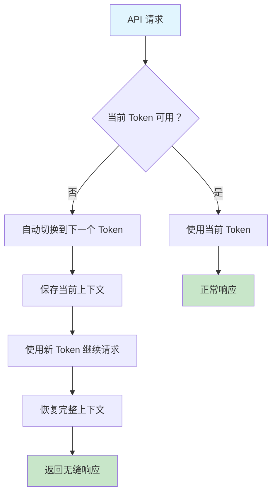

# 🤖 Claude API 代理服务 (Cloudflare Worker)

<div align="center">


[](LICENSE)
[](https://workers.cloudflare.com/)
[](https://github.com/yourusername/claude-proxy)
[](https://github.com/yourusername/claude-proxy)

> 🚀 **企业级** Claude API 代理服务，提供智能负载均衡、无缝上下文管理和自动故障转移

[🎯 快速开始](#-快速开始) • [📚 完整文档](#-完整功能特性) • [💡 使用示例](#-使用示例) • [🛠️ 故障排除](#️-故障排除)

</div>

---

## ⭐ 项目亮点

<table>
<tr>
<td width="50%">

### 🎯 **高可用性架构**
- ✅ **智能负载均衡** - 多 Token 池自动轮换
- ✅ **故障自愈** - Token 失效时自动切换
- ✅ **零停机** - 对用户完全透明的切换
- ✅ **全球部署** - Cloudflare 边缘网络

</td>
<td width="50%">

### 🧠 **智能上下文管理**
- ✅ **无缝对话** - 切换时保持对话连续性
- ✅ **上下文恢复** - 自动保存/恢复会话状态
- ✅ **智能合并** - 防止重复消息
- ✅ **历史管理** - 7天自动清理机制

</td>
</tr>
<tr>
<td width="50%">

### 🔐 **企业级安全**
- ✅ **双层权限** - 管理员/普通用户分离
- ✅ **密码保护** - Cloudflare Secrets 加密存储
- ✅ **输入验证** - 严格的数据校验
- ✅ **安全日志** - 完整的操作审计

</td>
<td width="50%">

### 🖥️ **直观管理界面**
- ✅ **可视化面板** - 现代化 Web UI
- ✅ **批量操作** - 一键验证/清理
- ✅ **实时状态** - Token 健康状况监控
- ✅ **分页展示** - 大量 Token 友好支持

</td>
</tr>
</table>

---

## 🚀 快速开始

### 📋 前置要求

| 要求 | 说明 |
|------|------|
| Cloudflare 账号 | 免费账号即可，[点击注册](https://dash.cloudflare.com/sign-up) |
| Claude Session Keys | 至少 1 个有效的 `sk-ant-sid01-` 开头的密钥 |
| 基础技能 | 会复制粘贴代码即可 🎯 |

### ⚡ 一键部署

<details>
<summary><b>🔧 第一步：创建 Worker 项目</b></summary>

1. 登录 [Cloudflare Dashboard](https://dash.cloudflare.com)
2. 导航至 `Workers & Pages` → `Create application` → `Create Worker`
3. 输入项目名称（如：`claude-api-proxy`）
4. 点击 `Save and Deploy`

</details>

<details>
<summary><b>💾 第二步：配置 KV 存储</b></summary>

```bash
# 在 Cloudflare Dashboard 中操作
Workers & Pages → KV → Create namespace
```

**创建命名空间：**
- **名称：** `SESSION_KEYS`
- **记录：** Namespace ID（后续需要）

**绑定到 Worker：**
1. 进入 Worker 设置页面
2. `Variables and Secrets` → `KV Namespace Bindings`
3. 添加绑定：`SESSION_KEYS` → 选择刚创建的命名空间

</details>

<details>
<summary><b>🔐 第三步：配置环境变量</b></summary>

在 Worker 的 `Variables and Secrets` 中添加：

| 变量名 | 类型 | 值 | 说明 |
|--------|------|-----|------|
| `ADMIN_PASSWORD` | Environment Variable | `你的安全密码` | ⚠️ **必须修改** |

> **🛡️ 安全提醒：** 请使用强密码，至少包含大小写字母、数字和特殊字符

</details>

<details>
<summary><b>📝 第四步：部署代码</b></summary>

1. 复制项目源码到 Worker 编辑器
2. **必须修改** 以下配置：

```javascript
const CONFIG = {
  ADMIN_PASSWORD: '你的强密码',  // ⚠️ 替换默认密码
  // 其他配置保持默认
  CACHE_TTL: 300,
  VALID_KEY_TTL: 3600,
  // ...
}
```

3. 点击 `Save and Deploy`

</details>

### 🎉 部署完成！

你的代理服务地址：`https://your-worker-name.your-subdomain.workers.dev`

---

## 📚 完整功能特性

### 🎯 **智能 Token 管理**



### 🔄 **自动切换机制**

| 触发条件 | 系统行为 | 用户体验 |
|----------|----------|----------|
| Token 过期/失效 | 立即切换到下一个可用 Token | 对话无中断继续 |
| 配额用尽 | 智能检测并自动轮换 | 感知不到任何异常 |
| 网络错误 | 重试机制 + Token 切换 | 自动恢复，无需干预 |
| 服务限流 | 负载均衡到其他 Token | 请求成功率接近 100% |

### 🧠 **上下文管理系统**

<table>
<tr>
<td width="50%">

**智能上下文保存：**
- 📝 自动保存完整对话历史
- 🔄 Token 切换时无缝继续
- 🎯 智能去重，避免重复消息
- ⏰ 7天自动清理过期数据

</td>
<td width="50%">

**会话状态管理：**
- 💾 实时保存会话参数
- 🔄 模型设置完整传承
- 🎛️ 温度、长度等参数保持
- 📊 请求统计和错误追踪

</td>
</tr>
</table>

---

## 🎮 使用示例

### 📡 **API 调用**

将你的 Claude API 端点替换为代理地址即可：

```bash
# 原始 Claude API
https://api.anthropic.com/v1/messages

# 替换为你的代理地址
https://your-worker-name.your-subdomain.workers.dev/v1/messages
```

### 🐍 **Python 示例**

```python
import requests

# 配置代理端点
PROXY_URL = "https://your-worker-name.your-subdomain.workers.dev/v1/messages"

def chat_with_claude(message):
    headers = {
        "Content-Type": "application/json",
    }
    
    data = {
        "model": "claude-3-sonnet-20240229",
        "max_tokens": 1024,
        "messages": [
            {"role": "user", "content": message}
        ],
        "conversation_id": "my-conversation-001"  # 可选：指定会话ID
    }
    
    response = requests.post(PROXY_URL, headers=headers, json=data)
    
    if response.status_code == 200:
        return response.json()
    else:
        print(f"Error: {response.status_code} - {response.text}")
        return None

# 使用示例
result = chat_with_claude("你好，请介绍一下自己")
print(result['content'][0]['text'])
```

### 🌐 **JavaScript/Node.js 示例**

```javascript
async function chatWithClaude(message, conversationId = null) {
    const response = await fetch('https://your-worker-name.your-subdomain.workers.dev/v1/messages', {
        method: 'POST',
        headers: {
            'Content-Type': 'application/json',
        },
        body: JSON.stringify({
            model: 'claude-3-sonnet-20240229',
            max_tokens: 1024,
            messages: [
                { role: 'user', content: message }
            ],
            conversation_id: conversationId || `conv-${Date.now()}`
        })
    });

    if (!response.ok) {
        throw new Error(`HTTP error! status: ${response.status}`);
    }

    const data = await response.json();
    return data.content[0].text;
}

// 使用示例
chatWithClaude('Hello, Claude!')
    .then(response => console.log(response))
    .catch(error => console.error('Error:', error));
```

### 📱 **流式响应示例**

```javascript
async function streamChat(message) {
    const response = await fetch('https://your-worker-name.your-subdomain.workers.dev/v1/messages', {
        method: 'POST',
        headers: {
            'Content-Type': 'application/json',
        },
        body: JSON.stringify({
            model: 'claude-3-sonnet-20240229',
            max_tokens: 1024,
            stream: true,  // 启用流式响应
            messages: [
                { role: 'user', content: message }
            ]
        })
    });

    const reader = response.body.getReader();
    const decoder = new TextDecoder();

    while (true) {
        const { done, value } = await reader.read();
        if (done) break;
        
        const chunk = decoder.decode(value);
        const lines = chunk.split('\n');
        
        for (const line of lines) {
            if (line.startsWith('data: ')) {
                const data = line.slice(6);
                if (data === '[DONE]') return;
                
                try {
                    const parsed = JSON.parse(data);
                    if (parsed.delta?.text) {
                        process.stdout.write(parsed.delta.text);
                    }
                } catch (e) {
                    // 忽略解析错误
                }
            }
        }
    }
}
```

---

## 🛠️ 管理面板指南

### 🏠 **主面板概览**

访问：`https://your-domain/api`

<table>
<tr>
<td width="33%">

**📊 状态仪表板**
- 当前活跃 Token
- Token 来源标识
- 总数统计
- 健康状况

</td>
<td width="33%">

**⚙️ 快速操作**
- Token 管理入口
- 快速切换功能
- API 使用说明
- 统计信息

</td>
<td width="33%">

**📖 使用指南**
- API 端点展示
- 请求示例
- 支持的功能
- 兼容性说明

</td>
</tr>
</table>

### 🔑 **Token 管理**

访问：`https://your-domain/tokens`

#### 👥 **普通用户功能**
- ✅ 添加普通用户 Session Keys
- ✅ 查看所有普通 Keys（安全截断显示）
- ✅ 一键复制 Keys 到剪贴板
- ✅ 实时验证状态查看

#### 🔧 **管理员功能**（需要密码）
- ✅ 所有普通用户功能
- ✅ 添加/删除管理员专属 Session Keys
- ✅ 批量验证所有 Keys 有效性
- ✅ 智能删除无效 Keys
- ✅ 按类型清空或全量清空 Keys

### 🔄 **快速切换**

访问：`https://your-domain/token`

- 🎯 下拉列表选择可用 Token
- 🏷️ 清晰标识 Token 类型（管理员/普通）
- ⚡ 一键切换当前活跃 Token
- ✅ 实时反馈切换结果

---

## 🔐 Session Key 获取指南

### 🌐 **方法一：浏览器获取**

<details>
<summary>点击展开详细步骤</summary>

1. **登录 Claude.ai**
   - 访问 https://claude.ai
   - 使用你的账号登录

2. **打开开发者工具**
   - 按 `F12` 键
   - 或右键 → "检查元素"

3. **找到 Session Key**
   - 切换到 `Application` 标签
   - 展开 `Storage` → `Cookies` → `https://claude.ai`
   - 找到 `sessionKey` 项
   - 复制其值（以 `sk-ant-sid01-` 开头）

</details>

### 🔧 **方法二：抓包获取**

<details>
<summary>点击展开详细步骤</summary>

1. **使用抓包工具**
   - 推荐：Chrome DevTools、Fiddler、Charles
   
2. **监听网络请求**
   - 登录 Claude.ai 后进行对话
   - 监听对 `https://api.claude.ai` 的请求

3. **提取 Session Key**
   - 查看请求头中的 `Cookie` 字段
   - 找到 `sessionKey=sk-ant-sid01-...` 部分
   - 复制 `sk-ant-sid01-` 开头的完整字符串

</details>

### ⚠️ **Session Key 安全须知**

| ⚠️ 警告 | 📋 说明 |
|---------|---------|
| **格式要求** | 必须以 `sk-ant-sid01-` 开头，长度通常为 100+ 字符 |
| **有效期** | 通常为几个月，过期后需要重新获取 |
| **安全性** | 相当于账号密码，切勿泄露给他人 |
| **使用限制** | 受 Claude 账号类型限制（Free/Pro/Team） |

---

## ⚙️ 高级配置

### 🎛️ **核心配置选项**

```javascript
const CONFIG = {
  // 🔐 安全配置
  ADMIN_PASSWORD: 'your-secure-password',    // ⚠️ 必须修改

  // ⏰ 缓存配置
  CACHE_TTL: 300,                            // 通用缓存时间（秒）
  VALID_KEY_TTL: 3600,                       // 有效Key缓存时间（秒）

  // 💬 上下文管理
  CONTEXT_MANAGEMENT: {
    ENABLED: true,                           // 启用上下文管理
    MAX_CONTEXT_MESSAGES: 50,                // 最大上下文消息数
    AUTO_CLEANUP_DAYS: 7,                    // 自动清理天数
    SEAMLESS_SWITCH_ENABLED: true,           // 启用无缝切换
    PRESERVE_CONVERSATION_STATE: true,       // 保持对话状态
  },

  // 🔄 自动切换
  AUTO_SWITCH: {
    ENABLED: true,                           // 启用自动切换
    MAX_RETRY_ATTEMPTS: 10,                  // 最大重试次数
    RETRY_DELAY_MS: 1000,                    // 重试延迟（毫秒）
    SMART_ERROR_DETECTION: true              // 智能错误检测
  },

  // 📄 分页配置
  ITEMS_PER_PAGE: 10,                        // 每页显示Token数量
}
```

### 🌐 **API 端点配置**

```javascript
API_ENDPOINTS: {
  CLAUDE_OFFICIAL: 'https://api.claude.ai/api/organizations',
  CLAUDE_API: 'https://api.claude.ai',
  FUCLAUDE_AUTH: 'https://demo.fuclaude.com/api/auth/session',
  FUCLAUDE_MESSAGES: 'https://demo.fuclaude.com/v1/messages',
  FUCLAUDE_LOGIN: 'https://demo.fuclaude.com/login_token'
}
```

### 📊 **性能优化建议**

| 配置项 | 推荐值 | 说明 |
|--------|--------|------|
| Token 数量 | 5-15 个 | 平衡可用性与管理复杂度 |
| 缓存时间 | 300 秒 | 减少 KV 读取，提升响应速度 |
| 上下文消息数 | 50 条 | 在功能性与存储成本间平衡 |
| 重试次数 | 10 次 | 确保高可用性 |

---

## 📈 监控与日志

### 📊 **实时监控**

在 Cloudflare Dashboard 中查看：

- **Real-time Logs**: 实时日志流
- **Analytics**: 请求统计分析
- **Performance**: 响应时间监控
- **Errors**: 错误率追踪

### 🔍 **关键指标**

| 指标 | 说明 | 正常范围 |
|------|------|----------|
| **成功率** | API 请求成功率 | > 99% |
| **响应时间** | 平均响应延迟 | < 2000ms |
| **Token 切换频率** | 每小时切换次数 | < 10 次 |
| **上下文保存率** | 对话状态保存成功率 | > 95% |

### 📝 **日志类型**

```javascript
// 系统会自动记录以下日志类型：
[INFO]  Token 切换事件: "Switched to next valid token: sk-ant-***"
[WARN]  Token 失效警告: "Token invalid, trying next: sk-ant-***"
[ERROR] API 请求错误: "All tokens validation failed"
[DEBUG] 上下文操作: "Saved conversation context: conv-123"
```

---

## 🛠️ 故障排除

### ❓ **常见问题**

<details>
<summary><b>❌ "No valid session keys found" 错误</b></summary>

**症状：** 访问首页或 API 时报错

**原因分析：**
- 所有 Session Keys 都已失效
- 没有添加任何 Session Keys
- KV 存储配置错误

**解决方案：**
1. 检查 KV 命名空间是否正确绑定
2. 添加至少 1 个有效的 Session Key
3. 验证 Session Key 格式（必须以 `sk-ant-sid01-` 开头）
4. 检查 Session Key 是否过期

</details>

<details>
<summary><b>🔐 管理员密码错误</b></summary>

**症状：** 无法登录管理员功能

**原因分析：**
- 未修改代码中的默认密码
- 输入密码与配置不匹配
- 环境变量未正确设置

**解决方案：**
1. 检查代码中 `CONFIG.ADMIN_PASSWORD` 的值
2. 确认环境变量 `ADMIN_PASSWORD` 正确设置
3. 清除浏览器 Cookie 后重新登录

</details>

<details>
<summary><b>🌐 CORS 跨域错误</b></summary>

**症状：** 浏览器控制台报 CORS 错误

**原因分析：**
- 跨域请求被阻止
- 请求头设置不正确

**解决方案：**
1. 代码已内置 CORS 处理，确保使用正确的请求格式
2. 检查请求的 Content-Type 是否为 `application/json`
3. 避免自定义不必要的请求头

</details>

<details>
<summary><b>💾 上下文切换失败</b></summary>

**症状：** Token 切换时丢失对话历史

**原因分析：**
- KV 存储读写失败
- 上下文数据过大
- 网络超时

**解决方案：**
1. 检查 KV 命名空间绑定
2. 减少 `MAX_CONTEXT_MESSAGES` 配置
3. 检查 Cloudflare Workers 的使用量限制

</details>

### 🔧 **诊断工具**

```javascript
// 在浏览器控制台中运行以下代码进行诊断

// 1. 检查 API 连通性
fetch('https://your-worker-name.workers.dev/v1/messages', {
    method: 'POST',
    headers: { 'Content-Type': 'application/json' },
    body: JSON.stringify({
        model: 'claude-3-sonnet-20240229',
        max_tokens: 10,
        messages: [{ role: 'user', content: 'test' }]
    })
}).then(r => console.log('Status:', r.status))

// 2. 检查管理面板
fetch('https://your-worker-name.workers.dev/api')
  .then(r => r.text())
  .then(html => console.log('Panel accessible:', html.includes('管理面板')))
```

### 📞 **获取帮助**

| 问题类型 | 解决渠道 |
|----------|----------|
| **部署相关** | [Cloudflare Workers 文档](https://developers.cloudflare.com/workers/) |
| **Claude API** | [Anthropic 官方文档](https://docs.anthropic.com/) |
| **KV 存储** | [Cloudflare KV 文档](https://developers.cloudflare.com/workers/runtime-apis/kv/) |
| **代码问题** | [GitHub Issues](https://github.com/yourusername/claude-proxy/issues) |

---

## 🎯 部署检查清单

在部署完成后，请按以下清单进行检查：

### ✅ **基础配置检查**

- [ ] ✅ 已创建 Cloudflare Workers 项目
- [ ] ✅ 已创建并绑定 KV 命名空间 `SESSION_KEYS`
- [ ] ✅ 已修改默认管理员密码
- [ ] ✅ 已设置环境变量 `ADMIN_PASSWORD`
- [ ] ✅ 已成功部署代码到 Workers

### ✅ **功能测试检查**

- [ ] ✅ 管理面板可正常访问 (`/api`)
- [ ] ✅ Token 管理功能正常 (`/tokens`)
- [ ] ✅ 已添加至少 1 个有效 Session Key
- [ ] ✅ API 调用功能正常 (`/v1/messages`)
- [ ] ✅ Token 自动切换功能正常
- [ ] ✅ 上下文无缝切换功能正常

### ✅ **安全检查**

- [ ] ✅ 管理员密码已修改为强密码
- [ ] ✅ Session Keys 来源安全可靠
- [ ] ✅ 环境变量正确配置
- [ ] ✅ 不包含任何硬编码敏感信息

### ✅ **性能监控**

- [ ] ✅ Cloudflare Analytics 正常记录
- [ ] ✅ 实时日志功能正常
- [ ] ✅ 响应时间在合理范围内（< 2秒）
- [ ] ✅ 错误率在可接受范围内（< 1%）

---

## 📜 许可证

本项目采用 MIT 许可证 - 详细信息请查看 [LICENSE](LICENSE) 文件。

---

## 🙏 致谢

感谢以下项目和服务的支持：

- [Cloudflare Workers](https://workers.cloudflare.com/) - 无服务器计算平台
- [Anthropic Claude](https://www.anthropic.com/) - 强大的 AI 助手
- 所有贡献者和用户的宝贵反馈

---

<div align="center">

### 🚀 现在就开始使用吧！

[](https://deploy.workers.cloudflare.com/?url=https://github.com/yourusername/claude-proxy)

**让 AI 对话更加流畅可靠** ✨

---

<sub>如果这个项目对你有帮助，请考虑给它一个 ⭐ Star</sub>

</div>
